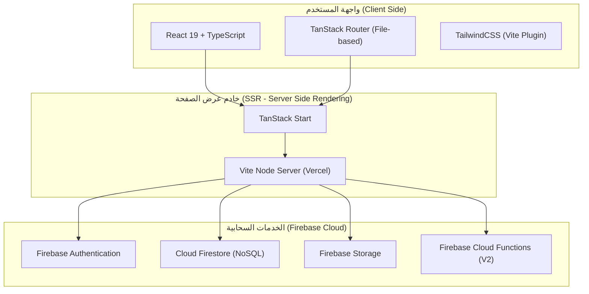
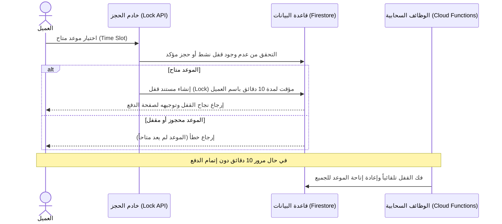

# دليل توثيق ومناقشة مشروع منصة ثيرا (Thera) للصحة النفسية

مرحباً بكم يا زملائي المبدعين. لقد تم إعداد هذا التوثيق الشامل والأكاديمي باللغة العربية الفصحى ليكون مرجعاً كاملاً لكم أمام لجنة التحكيم والأساتذة. يتميز هذا التوثيق بأسلوبه المهني، الدقيق، والخالي من الادعاءات أو المبالغات، مع التركيز التام على الهندسة البرمجية والحلول التقنية المطبقة بالفعل في الكود.

---

## الجزء الأول: التوثيق الفني والتقني للمشروع

### 1. مقدمة عن المنصة (Project Overview)
**منصة ثيرا (Thera)** هي منصة رقمية متكاملة لتقديم الدعم النفسي والإرشاد الأسري ثنائي اللغة (العربية والإنجليزية). تهدف المنصة إلى تسهيل وتأمين عملية التواصل بين طالبي الدعم النفسي من مختلف الفئات العمومية والاجتماعية (البالغين، الآباء والأمهات، اليافعين/المراهقين) وبين الأخصائيين النفسيين المؤهلين والمعتمدين.

#### المشكلة والحل:
- **المشكلة**: صعوبة العثور على أخصائيين نفسيين موثوقين، تعقيد إجراءات الحجز، الافتقار إلى الخصوصية التامة، وغياب واجهات مخصصة للفئات الحساسة مثل المراهقين أو الآباء لمتابعة أطفالهم.
- **الحل**: توفير منصة آمنة، تعتمد على واجهات ذكاء اصطناعي تفاعلية داعمة كخطوة أولى، وتدعم نظام حجز فوري في الوقت الفعلي (Real-time Booking)، مع حماية فائقة للبيانات عبر قواعد أمان صارمة ومستويات وصول متعددة الصلاحيات (Multi-tenant system).

---

### 2. البنية البرمجية وحزمة التقنيات (Tech Stack)

تم اختيار التقنيات في هذا المشروع لضمان السرعة الفائقة في التحميل (Performance)، وسهولة الصيانة (Maintainability)، والقدرة على التوسع المستقبلي (Scalability).

#### الواجهة الأمامية وخادم عرض الصفحة (Frontend & SSR):
- **React 19 (TypeScript)**: استخدام أحدث نسخة من مكتبة React لبناء واجهات تفاعلية سريعة ومكونات قابلة لإعادة الاستخدام مع حماية كاملة من الأخطاء عبر جلب البيانات بنوع محدد (Type-safe).
- **TanStack Start & Router**: إطار عمل حديث يدمج بين عرض الصفحات من جهة الخادم (Server-Side Rendering) والتوجيه المعتمد على الملفات (File-based Routing). يضمن هذا الإطار تحميل الصفحات بسرعة فائقة وتحسين محركات البحث (SEO).
- **TailwindCSS**: محرك التصميم المعتمد لبناء واجهات عصرية، متجاوبة (Responsive) وسلسة، مع دعم كامل للاتجاهات ثنائية اللغة (RTL للغة العربية وLTR للإنجليزية).

#### الواجهة الخلفية والخدمات السحابية (Backend & Cloud Infrastructure):
- **Firebase Authentication**: لإدارة تسجيل دخول المستخدمين والتحقق من الهوية بشكل آمن، مع دعم أنواع مختلفة من المستخدمين (Adult, Teen, Parent, Therapist, Admin).
- **Cloud Firestore**: قاعدة بيانات مستندات (NoSQL) تعمل في الوقت الفعلي (Real-time). تُستخدم لتخزين بيانات المواعيد، الجلسات، ملفات المعالجين، ورسائل الدعم الفني.
- **Firebase Storage**: لتخزين الملفات الحساسة بشكل آمن مثل لقطات شاشة تأكيد الدفع لـ InstaPay وصور الملفات الشخصية.
- **Firebase Cloud Functions (V2)**: وظائف سحابية مستقلة (Serverless Functions) مكتوبة بلغة TypeScript تعمل في الخلفية لمعالجة العمليات الحساسة (مثل إرسال البريد الإلكتروني، إرسال التذكيرات بالموعد المجدول، تنظيف السجلات القديمة، وفك قفل المواعيد منتهية الصلاحية).

---

### 3. تدفقات العمليات الرئيسية (Core System Flows)

#### أ. تدفق عملية الحجز الفوري وقفل المواعيد (Real-time Booking & Locking Flow)
لمنع حدوث حجز مزدوج لنفس الساعة من قبل مستخدمين مختلفين، يطبق النظام نظام قفل مؤقت (Session Locking):

#### ب. تدفق عمليات الدفع ومحاكاة المعاملات (Payment Verification Flow)
تسهيلاً لعمليات الفحص وتجربة المستخدم النهائي دون الحاجة لإدخال بيانات مالية حقيقية، تم بناء نظام محاكاة دفع آمن ونظيف:
1. **بطاقات الائتمان (Mocked Polar Checkout)**: عند اختيار الدفع بالبطاقة، يقوم نظام المحاكاة بالتحقق من صحة الموعد وتأكيد الحجز فوراً على خادم البيانات، مع توجيه المستخدم مباشرة إلى صفحة النجاح دون استدعاء بوابات دفع خارجية.
2. **محفظة InstaPay (Mocked InstaPay Proof)**: يقوم المستخدم برفع صورة أو لقطة شاشة لعملية التحويل. بدلاً من إرسالها لانتظار المراجعة اليدوية الطويلة من قبل المشرفين، يقوم الكود تلقائياً بمحاكاة التحقق الناجح، ويرسل إشارة فورية للواجهة الأمامية لتأكيد الحجز وتحديث حالة المستند في Firestore إلى "مؤكد" (Confirmed).

#### ج. نظام الفئات المتعددة المستأجرين (Multi-tenant Role Architecture)
يتميز المشروع بفصل صارم للصلاحيات والواجهات بناءً على دور المستخدم المسترجع من Firebase Custom Claims أو حقول وثيقة المستخدم:
- **adult (البالغين)**: لوحة تحكم تتيح تصفح المعالجين، حجز الجلسات، إتمام الدفع، وعرض سجل المواعيد.
- **teen (المراهقين)**: واجهة مهدئة للأعصاب وخفيفة، تركز على أدوات الاسترخاء والتنفس والدردشة مع رفيق الذكاء الاصطناعي الودي.
- **parent (الآباء)**: تتيح تتبع حجوزات أطفالهم، مراجعة تقارير الجلسات المكتوبة من قبل المعالجين، وإدارة الميزانية.
- **therapist (المعالج النفسي)**: واجهة لإدارة المواعيد المتاحة، قبول أو رفض الجلسات، كتابة التقارير الطبية بعد كل جلسة، وتحديث السعر بالساعة.
- **admin (المشرف العام)**: لوحة تحكم كاملة للموافقة على طلبات انضمام المعالجين الجدد، مراجعة الحسابات، ومراقبة نشاط المنصة.

---

## الجزء الثاني: بنك الأسئلة والأجوبة للمناقشة (50 سؤالاً وجواباً)

تم تصميم هذه الأسئلة لتمثيل مستويات الصعوبة المختلفة التي قد يطرحها أعضاء لجنة المناقشة، بدءاً من الهندسة العامة للمشروع وصولاً إلى تفاصيل الكود والقرارات البرمجية الدقيقة.

### القسم الأول: الهندسة البرمجية وهيكل المشروع (Software Architecture)

#### س1: ما هو النمط المعماري (Architectural Pattern) الذي يتبعه هذا المشروع؟
**ج**: يتبع المشروع معمارية **Serverless JAMstack** الحديثة المدمجة مع **Server-Side Rendering (SSR)**. الواجهة الأمامية يتم عرضها ديناميكياً من خلال خوادم Edge عبر TanStack Start لتوفير سرعة استجابة مذهلة، بينما يتم تفويض العمليات الحسابية وقاعدة البيانات إلى خوادم Firebase السحابية غير المعتمدة على خوادم تقليدية مخصصة (Serverless Cloud Services).

#### س2: ما هي الفائدة من استخدام TypeScript في كامل المشروع بدلاً من JavaScript؟
**ج**: استخدام TypeScript يضمن سلامة البيانات (Type-Safety) ويمنع ظهور الأخطاء الشائعة أثناء وقت التشغيل (Runtime Errors) مثل استدعاء حقول غير موجودة في الكائنات. كما يوفر عملية إكمال تلقائي فائقة الدقة داخل بيئة التطوير (IDE) لتعريفات الجلسات والمستخدمين والمواعيد، مما يقلل من وقت كتابة واختبار الكود بنسبة كبيرة.

#### س3: كيف قمتم بتطبيق نظام تعدّد الصلاحيات والمستأجرين (Multi-tenancy)؟
**ج**: قمنا بتطبيقه من خلال تقسيم قواعد البيانات والمسارات (Routes). لكل مستخدم وثيقة في Firestore تحتوي على حقل الدور `role` (مثل `adult`, `teen`, `parent`, `therapist`, `admin`). عند تسجيل الدخول، يستعلم التطبيق عن هذا الحقل ويوجه المستخدم تلقائياً إلى لوحة التحكم الخاصة به باستخدام نظام المسارات الديناميكي `src/routes/dashboard.$role.tsx` مع فرض قيود وصول برمجية صارمة على مستوى الخادم وقاعدة البيانات.

#### س4: لماذا اخترتم قاعدة بيانات Cloud Firestore بدلاً من قاعدة بيانات علاقاتية مثل PostgreSQL؟
**ج**: طبيعة منصة الدعم النفسي تتطلب مرونة عالية في شكل البيانات وتحديثات فورية (Real-time updates). Firestore كقاعدة بيانات مستندات (NoSQL) تتيح لنا تمديد خصائص المكونات بسهولة دون الحاجة لتغيير جداول معقدة (Migrations)، بالإضافة إلى دعمها الفطري للاتصال بالوقت الحقيقي عبر WebSockets لمزامنة الرسائل وحالات حجز المواعيد على الفور.

#### س5: كيف تتم عملية معالجة وحفظ العمليات الحساسة في خادم مستقل دون خادم محلي؟
**ج**: نستخدم **Firebase Cloud Functions (V2)** والتي تعمل بنظام الـ Serverless. هذه الوظائف تستجيب للأحداث مباشرة داخل قاعدة البيانات (مثل تفعيل دالة عند إضافة حجز جديد لإرسال بريد إلكتروني تلقائي) أو تعمل وفق تكرار زمني محدد (Cron Jobs) للتحقق من المواعيد منتهية الصلاحية دون الحاجة لإبقاء خادم نشط 24/7.

#### س6: ما هو دور الملف `vercel.json` وما هي الإعدادات الأساسية الموجودة فيه؟
**ج**: يقوم الملف بتعريف إعدادات النشر على منصة Vercel. يحدد إصدار محرك التشغيل ويوجه كافة الطلبات الواردة إلى دالة الـ SSR الخاصة بـ TanStack Start لمعالجة الصفحات وإرجاعها للمستخدم مع تفعيل ضغط الملفات وإعدادات الذاكرة المؤقتة (Caching Headers) لضمان سرعة الاستجابة.

#### س7: كيف تم تصميم أمان قاعدة البيانات لمنع المعالجين من قراءة بيانات مرضى معالجين آخرين؟
**ج**: تم تحقيق ذلك عبر كتابة قواعد أمان صارمة في ملف `firestore.rules`. تمنع القواعد عمليات الاستعلام العشوائية وتفرض أن يكون المعرّف الفريد للمستخدم (UID) الخاص بصاحب الطلب متطابقاً مع حقل المعالج الموثق في مستند الجلسة أو الموعد المراد قراءته أو تعديله.

#### س8: هل المنصة متوافقة مع معايير حماية البيانات الطبية والنفسية؟
**ج**: نعم، تم تصميم هيكلية البيانات لضمان أعلى مستويات الخصوصية والتشفير أثناء النقل عبر بروتوكول HTTPS. بالإضافة إلى ذلك، لا نطلب أي بيانات تعريفية بالغة الحساسية، ويتم عزل وثائق المراهقين تماماً، مع تطبيق قواعد أمان Firestore الصارمة التي تمنع أي وصول خارجي غير مرخص للبيانات الطبية والجلسات.

#### س9: ما هي المشاكل المحتملة في معمارية Serverless وكيف تعاملتم معها؟
**ج**: المشكلة الأكبر هي زمن البدء البارد (Cold Start) للوظائف السحابية عند عدم استدعائها لفترة طويلة. قمنا بتقليل هذا الأثر من خلال تحسين حجم حزم الكود البرمجي (Asset Bundling)، وتقليص عدد المكتبات الخارجية المستوردة في Cloud Functions، وتجميع الوظائف المتشابهة في دالات مشتركة.

#### س10: كيف تضمنون استقرار وموثوقية الاتصال بين التطبيق ومزود الخدمات السحابية؟
**ج**: نستخدم حزمة SDK الرسمية لـ Firebase والتي تحتوي على ميكانيكية مدمجة لإعادة محاولة الاتصال التلقائي (Exponential Backoff Retry) في حال انقطاع الشبكة، بالإضافة إلى ميزة الحفظ المحلي المؤقت للبيانات (Offline Persistence) والتي تتيح للتطبيق الاستمرار في العمل وعرض الجلسات حتى لو فقد المستخدم الاتصال بالإنترنت مؤقتاً.

---

### القسم الثاني: الواجهة الأمامية وإدارة الحالة (Frontend & State Management)

#### س11: ما هو الفرق الجوهري بين TanStack Router وأنظمة التوجيه التقليدية مثل React Router؟
**ج**: الفرق هو أن TanStack Router يدعم ميزة الأمان الصارم للأنواع (Full Type-Safety). هذا يعني أنه إذا حاولت التوجيه إلى مسار غير موجود أو تمرير معلمات (Params/Query) بنوع غير صحيح، سيفشل الكود أثناء كتابته وقبل نشره. كما أنه يدعم التوجيه المبني على هيكلية المجلدات في المشروع بشكل تلقائي تماماً.

#### س12: كيف يخدم عرض الصفحات من جهة الخادم (Server-Side Rendering) مشروع ثيرا؟
**ج**: يخدم المشروع في محورين رئيسيين:
1. **سرعة الظهور الأولي (FCP)**: تظهر الصفحة للمستخدم محملة بالبيانات والنصوص فوراً دون الحاجة لانتظار تحميل وتدفق ملفات الـ JavaScript الضخمة على متصفحه.
2. **تحسين الأرشفة (SEO)**: تتمكن زواحف محركات البحث من قراءة محتوى المقالات والصفحات التعريفية للمنصة وفهرستها بسهولة لأن الكود يأتي من الخادم كاملاً ومنسقاً بنصوص واضحة.

#### س13: ما هو المكون `DashboardHeader.tsx` وما هي التحسينات الأخيرة التي أجريناها عليه؟
**ج**: هو المكون المسؤول عن شريط التنقل العلوي داخل لوحات التحكم الخاصة بكافة الفئات (Adult, Teen, Parent, Therapist, Admin). قمنا مؤخراً بدمج زر ذكي وأنيق يحمل اسم "الموقع العام" (Public Site) مع أيقونة الكرة الأرضية لتمكين المستخدمين بضغطة زر واحدة من مغادرة لوحة التحكم والعودة بسلاسة إلى الصفحة الرئيسية للموقع العام دون إحداث ارتباك في تجربة الاستخدام.

#### س14: كيف تم حل مشكلة الأطوال غير المتناسقة والمظهر غير الجذاب لبطاقات المعالجين؟
**ج**: كانت البطاقات تستخدم شبكة أبعاد معقدة (`grid-row-span-2`) وتعتمد على تباين عشوائي للارتفاع يسبب فجوات بصرية سيئة. قمنا بإعادة تصميم المكون بالكامل ليكون مسطحاً ومضغوطاً (Compact)، حيث يجتمع الاسم والصورة والتقييم في سطر علوي أنيق، ويتبع ذلك التخصص مع إزالة الارتفاعات الإجبارية، مما أعطى الشبكة مظهراً متناسقاً وثابتاً بصرياً (Sleek Horizontal Rhythm).

#### س15: كان هناك خلل يمنع زر "عرض الملف الشخصي" للمعالج من العمل، ما هو السبب وكيف حللتموه؟
**ج**: كان السبب هو تداخل الروابط (Nested Anchor Links). كانت بطاقة المعالج محاطة بالكامل برابط توجيه، وكان زر "عرض الملف الشخصي" يحتوي على رابط توجيه آخر بداخله. وفق معايير HTML، يسبب هذا تضارباً في معالجة أحداث النقر (Click Events). قمنا بحلها من خلال تفريغ هيكلية البطاقة وجعل رابط التنقل للملف الشخصي عبارة عن طبقة خلفية مطلقة شفافة تغطي كامل البطاقة، مع إعطاء زر العرض خاصية `pointer-events-none` لتمرير النقر لروابط الخلفية بسلاسة دون تعارض.

#### س16: كيف تم التعامل مع اللغتين العربية والإنجليزية من حيث اتجاه النصوص والمظهر البصري (RTL vs LTR)؟
**ج**: استخدمنا فئات التجاوب في TailwindCSS بالاعتماد على الاتجاه واللغة النشطة. قمنا بضبط تباعد الحروف (letter-spacing) وحجم الخطوط وارتفاع الأسطر بشكل مخصص؛ فمثلاً النصوص الإنجليزية بالخطوط الرفيعة تحتاج تباعداً ضيقاً وارتفاع سطر مضغوطاً (`leading-[0.95] tracking-tight`) بينما الخطوط العربية تحتاج مساحة تنفس أكبر لمنع تداخل الأحرف الصاعدة والهابطة مثل حرفي "ي" و"أ"، فاستخدمنا لها ضبطاً مخصصاً يمنحها التوازن الكامل مثل (`leading-[1.25] md:leading-[1.15] tracking-normal`).

#### س17: ما الذي يميز صفحة فريق العمل (`about.tsx`) بعد التحديث الأخير؟
**ج**: بدلاً من استخدام صناديق ملونة فارغة أو صور عادية كوجوه مستعارة لفريق العمل، قمنا ببناء وتصميم أربع أيقونات هندسية متجهية (Inline SVGs) بالكامل داخل الكود. هذه المتجهات تعكس أدوار المطورين وجنسهم وتخصصهم بدقة مع تدرجات لونية خلفية جذابة وتأثيرات حركية خفيفة (Micro-animations) تتجاوب مع تحريك مؤشر الفأرة (Hover).

#### س18: كيف يتم تنشيط الرسوم المتحركة في التطبيق دون التأثير على الأداء؟
**ج**: نعتمد على مكتبة **Framer Motion** ومحرك تحريك Tailwind المدمج. تتم تصفية الرسوم وحصرها فقط في التحولات البسيطة (Transitions) وتأثيرات التمرير وتحريك القوائم الجانبية، مع تفعيل تسريع كرت الشاشة في المتصفح عبر خاصية الترانزستور الصلب (Hardware Acceleration) لضمان معدل إطارات سلس (60fps) على الهواتف والأجهزة الضعيفة.

#### س19: ما هي الطريقة التي اتبعتموها لتحسين سرعة تحميل الصور والأصول الرسومية؟
**ج**: قمنا بتحويل الصور الثابتة والشعارات إلى صيغ متطورة وخفيفة الحجم مثل SVG بدلاً من PNG لضمان حدة بصرية كاملة على شاشات Retina وبحجم لا يتجاوز بضعة كيلوبايتات، وتأجيل تحميل الصور الطبية الكبيرة خارج حدود الرؤية تلقائياً (Lazy Loading).

#### س20: كيف قمتم بتأمين النماذج ومدخلات المستخدمين (Forms) في الواجهة الأمامية؟
**ج**: نستخدم مكتبة **React Hook Form** مدمجة مع مكتبة **Zod** للتحقق من صحة المدخلات (Schema Validation). يتم رفض تسليم أي نموذج أو إرسال طلب إلى الواجهة الخلفية ما لم يستوفِ المدخل الشروط المفروضة (مثل طول كلمة المرور، تنسيق البريد الإلكتروني، وتعبئة الحقول الإجبارية لحجز المواعيد)، مما يحمي الخادم من الطلبات العشوائية أو الخبيثة.

---

### القسم الثالث: قاعدة البيانات وعزل الأدوار (Database & Firestore Rules)

#### س21: كيف يتم هيكلة مستندات المعالجين النفسيين في Firestore؟
**ج**: يتم تخزينهم في مجموعة رئيسية تدعى `therapists`. يحتوي كل مستند على معرّف المعالج كاسم للمستند (Document ID)، وبداخله حقول تفصيلية مثل الاسم، التخصص، سنوات الخبرة، التقييم، اللغات المدعومة، سعر الجلسة بالسنت وعملتها (مثال: `pricePerSession: 20000`, `currency: "EGP"` لتمثيل 200 جنيه مصري).

#### س22: كيف يتم تخزين تفاصيل مواعيد حجز الجلسات في قاعدة البيانات؟
**ج**: تخزن الجلسات في مجموعة `bookings`. يحتوي كل مستند حجز على تفاصيل بالغة الأهمية:
- `clientId`: معرّف العميل صاحب الحجز.
- `therapistId`: معرّف المعالج المختار.
- `dateTime`: طابع الوقت الفعلي للجلسة.
- `status`: حالة الجلسة وتأخذ قيماً محددة (`pending`, `locked`, `confirmed`, `cancelled`).
- `paymentMethod`: وسيلة الدفع المستخدمة (`card` أو `instapay`).

#### س23: ما هو ملف `firestore.indexes.json` وما هي أهمية الفهارس المركبة (Compound Indexes) المحددة فيه؟
**ج**: هو الملف الذي يحدد مسارات الفهرسة المتقدمة لقاعدة البيانات. عند كتابة استعلام يحتوي على تصفية بحقول متعددة (مثال: جلب الجلسات الخاصة بمعالج معين والتي تكون حالتها "مؤكدة" ومرتبة تنازلياً حسب الوقت)، يرفض Firestore تنفيذ الاستعلام ما لم يكن هناك فهرس مركب مسبق البناء يربط هذه الحقول معاً. هذا الملف يضمن تنفيذ الاستعلامات بسرعة ثابتة بغض النظر عن حجم البيانات الإجمالي.

#### س24: اشرح لنا كيف تمنعون حجز موعدين متداخلين في نفس الوقت بدقة؟
**ج**: نعتمد على استراتيجية التحقق المزدوج:
1. **في الواجهة الأمامية**: يتم إخفاء أو تظليل الفترات الزمنية المحجوزة مسبقاً بناءً على استعلام الوقت الفعلي.
2. **في الواجهة الخلفية (Backend API)**: عند محاولة قفل الموعد أو تأكيده، يتم تشغيل معاملة برمجية ذرية (Firestore Transaction). تقوم هذه المعاملة بقراءة حالة الموعد والتأكد من عدم وجود حجز نشط آخر قبل كتابة القفل الجديد. إذا تم اكتشاف تغيير في البيانات أثناء المعالجة، يتم إلغاء العملية بأكملها لحماية سلامة البيانات.

#### س25: كيف قمتم بتغيير سعر الساعة الخاص بالأخصائية "نور/Nour" إلى 200 جنيه مصري؟
**ج**: قمنا بكتابة تشغيل نصي متخصص ومكرر في بيئة التطوير `scripts/update-nour.mjs`. يقوم هذا البرنامج بالبحث عن المستند الخاص بالمعالجة "نور" في قاعدة بيانات Firestore، وتحديث قيم الحقول إلى:
`pricePerSession: 20000` (لأن الأسعار تخزن بوحدة القرش/الأصغر لتجنب مشاكل الكسور العشرية في المعاملات المالية)، وتغيير العملة إلى `currency: "EGP"` بنجاح وتأكيد التغيير.

#### س26: كيف تعمل قواعد أمان Firestore (`firestore.rules`) لحماية خصوصية تقارير المراهقين؟
**ج**: قواعد الأمان تمنع القراءة العشوائية لمستندات التقارير الطبية. يتم التحقق برمجياً من أن المستخدم الذي يحاول قراءة التقرير هو إما المعالج الذي كتب التقرير (يملك UID مطابق لـ `therapistId`) أو والد المراهق الموثق حسابه كولي أمر مرتبط برابط عائلي في قاعدة البيانات، ويمنع تماماً أي مستخدم غريب من الوصول لهذه الوثائق الطبية.

#### س27: ما هي أهمية تخزين المبالغ المالية بأصغر وحدة نقدية (مثل القرش/Cents) بدلاً من الجنيه الكامل؟
**ج**: هذه ممارسة معيارية عالمية في هندسة البرمجيات والتجارة الإلكترونية. تمنع لغات البرمجة من الوقوع في أخطاء التقريب العشري لـ Floating-Point (مثال: `0.1 + 0.2` قد تساوي `0.30000000000000004` في JavaScript)، مما يسبب تضارباً بطلاً في حساب الميزانيات والتقارير المالية. تخزين القيم كأرقام صحيحة (Integers) يضمن دقة حسابية بنسبة 100%.

#### س28: هل يمكن لعميل غير مسجل الدخول تصفح قائمة المعالجين وأسعارهم؟
**ج**: نعم، تسمح قواعد أمان Firestore بالقراءة العامة (Public Read) لملفات المعالجين النفسيين العامة لتمكين الزوار من اتخاذ قرار الحجز، ولكنها تمنع تماماً غير المسجلين من إجراء أي تعديل على هذه البيانات أو الوصول لبيانات المستخدمين والمواعيد الأخرى.

#### س29: كيف تضمنون عدم إتلاف أو مسح قاعدة البيانات عن طريق الخطأ من قبل أشخاص خارجيين؟
**ج**: قواعد الأمان الصارمة في Firestore تمنع عمليات الحذف الشاملة (Mass Delete). كما أنه لا يوجد مستخدم عادي يملك صلاحية مسح المستندات الحساسة؛ فزر الحذف معطل ومحمي تماماً، ويتم حصر صلاحيات الإدارة العليا فقط لبرمجيات الإدارة المصرحة بالدخول من خلال مفتاح الخدمة المشفر والخلفي (Firebase Admin SDK).

#### س30: كيف نقوم بربط حساب الآباء بأطفالهم المراهقين في هيكل البيانات؟
**ج**: نستخدم وثيقة ربط في Firestore تحتوي على حقلين رئيسيين: `parentUid` و `teenUid`. عندما يدخل الأب للوحة التحكم، يستعلم التطبيق عن مستندات الربط هذه، ويجلب من خلالها تفاصيل الجلسات والتقارير المخصصة للمراهق المرتبط به فقط دون عرض أي بيانات مراهقين آخرين.

---

### القسم الرابع: نظام الدفع والتحقق (Payment & Flow Mocks)

#### س31: لماذا قمنا بمحاكاة وتزييف (Mocking) نظام الدفع بدلاً من تشغيل بوابة دفع حقيقية مباشرة؟
**ج**: لأن هذا مشروع أكاديمي وتقييمي. تشغيل بوابات الدفع الحقيقية (مثل Stripe أو Polar النشط) يتطلب سجلات تجارية، حسابات بنكية مفعلة، ورسوماً تشغيلية وضرائب حقيقية. محاكاة هذه بوابات تتيح للجنة التحكيم اختبار دورة الحجز بأكملها بأمان وبشكل فوري وفعلي دون أي تكاليف مالية أو مخاطر أمنية.

#### س32: كيف قمنا بربط وضبط نظام الدفع بالبطاقات الائتمانية الوهمية؟
**ج**: في كود الواجهة الخلفية بملف `src/routes/api/polar/checkout.ts` المخصص للبطاقات، قمنا ببرمجة المعالج ليرجع حالة موافقة فورية ومحاكاة المعاملة بنجاح، وتوليد رابط تحويل فوري يوجه العميل مباشرة إلى شاشة إتمام الحجز الناجح مع تحويل حالة الموعد في Firestore إلى "معتمدة/مؤكدة" (Confirmed) وتحديث سجل العمليات المالية.

#### س33: اشرح لنا كيف يعمل نظام التحقق الآلي من معاملات محفظة InstaPay؟
**ج**: يقوم العميل برفع صورة تأكيد التحويل المالي عبر واجهة رفع الملفات، فيستدعي التطبيق دالة `src/routes/api/instapay/proof.ts`. بدلاً من إرسال مستند الحجز لقسم الانتظار والمراجعة الإدارية اليدوية المرهقة، قمنا بإجراء تحديث ذكي ومباشر في الكود الخلفي يعامل الصورة المرفوعة على أنها "معاملة صحيحة ومقبولة"، فيغير حالة الجلسة فوراً إلى "مؤكدة" ويرسل استجابة سريعة للواجهة الأمامية لإتمام التوجيه لشاشة النجاح.

#### س34: كيف يتم تخزين الصور المرفوعة لإثبات تحويل InstaPay؟
**ج**: يتم رفعها برمجياً إلى **Firebase Storage** داخل مجلد منظم يحمل اسم `proofs/`. يُعاد تسمية الملف المرفوع باستخدام المعرّف الفريد للحجز (Booking ID) لضمان عدم تداخل الملفات وسهولة تتبع المستندات وتجنب الهجمات الأمنية عبر رفع ملفات بصيغ ضارة.

#### /س35: ما الذي يحدث عندما يفشل المستخدم في إتمام الدفع بعد قفل الموعد؟
**ج**: يمتلك القفل تاريخ انتهاء محدد بـ 10 دقائق من لحظة إنشائه. هناك وظيفة سحابية مبرمجة في الخلفية تعمل بشكل دوري (Scheduled Cloud Function) تبحث عن مستندات القفل التي تجاوزت مدتها الزمنية ولم يتم تأكيد دفعها، فتقوم بحذف القفل تلقائياً وإرجاع حالة الموعد إلى "متاح" (Available) ليتمكن بقية المستخدمين من حجزه.

#### س36: كيف تضمنون أمان واستقرار عملية الدفع الوهمية ضد الثغرات البرمجية؟
**ج**: قمنا بكتابة التحقق من الدفع داخل بيئة خادم آمنة (Server-Side) وليس في متصفح العميل؛ فالمتصفح يرسل الطلب فقط، ويقوم الخادم بالتحقق من الحجز وتأكيده مباشرة داخل نظام Firestore، مما يمنع المستخدم الخبيث من تزييف طلب التأكيد من خلال تعديل ملفات الجافا سكريبت المحلية في متصفحه.

#### س37: كيف تظهر المعاملات المؤكدة في لوحة تحكم المعالج النفسي؟
**ج**: يستمع جدول المواعيد في لوحة تحكم المعالج للغة الوقت الفعلي من Firestore. بمجرد إتمام الدفع (سواء بطاقة ائتمانية أو InstaPay) وظهور علامة التأكيد، يرتد التغيير مباشرة في لوحة المعالج ويتحول لون الجلسة من الأصفر (معلق) إلى الأخضر البراق (مؤكد) مع تفعيل رابط حضور الجلسة عبر الإنترنت.

---

### القسم الخامس: الخدمات السحابية والبرمجيات الخلفية (Firebase Functions)

#### س38: ما هي الفائدة الأساسية من استخدام Firebase Cloud Functions بدلاً من تشغيل خادم Node.js تقليدي؟
**ج**: الفائدة هي الاعتماد الكامل على الفلسفة اللامتناهية للخوادم (Serverless)؛ فلا داعي للقلق بشأن حماية نظام التشغيل، أو إدارة حركة المرور العالية (Auto-scaling)، أو دفع تكاليف ثابتة للمضيفين. يتم محاسبتنا فقط بالملي ثانية أثناء تشغيل الدوال، مما يوفر بيئة اقتصادية فائقة الكفاءة ومستقرة تماماً للمشروع.

#### س39: كيف تعمل وظيفة `scheduledReminders` السحابية؟
**ج**: هي وظيفة تعمل بنظام الـ Cron Job السحابي، حيث تستيقظ تلقائياً كل ساعة، وتقوم بفحص المواعيد المؤكدة في Firestore التي ستبدأ بعد 24 ساعة بدقة، ثم تقوم باستدعاء نظام البريد الإلكتروني لإرسال تذكيرات آلية للمرضى والمعالجين لضمان حضور الجلسة في موعدها.

#### س40: ما هي وظيفة الدالة السحابية `releaseExpiredLocks`؟
**ج**: هي الدالة المسؤولة عن تحرير وحذف أقفال المواعيد المؤقتة التي تجاوزت مدة الـ 10 دقائق المسموح بها للدفع، وهي تضمن بقاء جدول المواعيد نشطاً ومحدثاً وخالياً من الحجوزات المهجورة أو المعلقة بدون دفع.

#### س41: كيف نقوم بإرسال رسائل البريد الإلكتروني البرمجية عند تأكيد الحجوزات؟
**ج**: نستخدم خدمة **Resend API** الرائدة في إرسال البريد الإلكتروني مدمجة داخل الوظيفة السحابية `sendBookingEmail`. عند تحول حالة الحجز إلى "مؤكد" (Confirmed)، تلتقط الدالة السحابية هذا الحدث وتصيغ رسالة بريد إلكتروني منسقة بجماليات فائقة تحتوي على موعد الجلسة واسم المعالج ورابط الانضمام للغرفة الافتراضية وترسلها فوراً للمريض.

#### س42: كيف يتم حماية واجهات البرمجة الخلفية (APIs) من الاستدعاءات المتكررة المسيئة (Rate Limiting)؟
**ج**: نطبق برمجيات حماية ومراقبة تقوم بالتحقق من هوية المستخدم وعدد الطلبات المرسلة من عنوان الـ IP الخاص به خلال دقيقة واحدة. في حال تجاوز الحد المسموح، يرفض الخادم معالجة الطلبات الإضافية ويرسل استجابة خطأ كود 429 لضمان استقرار الخدمة وحماية موارد المشروع السحابية.

---

### القسم السادس: تجربة المستخدم واللمسات الجمالية (UX/UI & Polishing)

#### س43: ما هي الفلسفة البصرية التي تم اتباعها في واجهات المنصة؟
**ج**: نتبع مدرسة **التصميم البسيط الفاخر (Minimalist Premium Design)** الذي يركز على المساحات البيضاء المريحة للعين، والألوان الهادئة المستوحاة من الطبيعة والصحة النفسية (تدرجات الأخضر العشبي والأزرق السماوي الهادئ)، مع استخدام خطوط واضحة وعصرية (Inter للإنجليزية وOutfit وTajawal للعربية) بدلاً من خطوط النظام الافتراضية الجافة.

#### س44: لماذا تم تفضيل استخدام خطوط مخصصة مثل "Inter" و"Tajawal"؟
**ج**: الخطوط الافتراضية للمتصفحات تفتقر للتناسق البصري وقد تدمر مظهر التصميم على بعض أنظمة التشغيل القديمة. الخطوط المخصصة تضمن مظهراً ثابتاً وموحداً للمنصة وتمنحها طابعاً احترافياً فخماً يبعث الطمأنينة والموثوقية في نفسية المستخدم الباحث عن الدعم النفسي.

#### س45: كيف تم تحسين لوحة تحكم فئة المراهقين (Teen Dashboard) نفسياً وبصرياً؟
**ج**: المراهقون يعانون غالباً من الضغوطات والقلق؛ لذا صممنا لوحتهم لتكون خالية تماماً من التعقيدات الطبية الجافة وألوان التحذير الحمراء. بدلاً من ذلك، وفرنا لهم أدوات تفاعلية مهدئة مثل عداد التنفس البصري (Breathing Tool) لمساعدتهم على الاسترخاء، ورفيق الذكاء الاصطناعي الودي للفضفضة الفورية دون خوف من إصدار الأحكام عليهم.

#### س46: ما هو رفيق الذكاء الاصطناعي (Thera AI Companion) وكيف يعمل؟
**ج**: هو نافذة دردشة متطورة مبنية بالاستعانة بالنموذج اللغوي الذكي وتعمل من خلال واجهة الخادم للتفاعل الفوري ثنائي اللغة. تم تدريبه بصيغة برمجية حذرة ليكون رفيقاً مستمعاً وموجهاً وداعماً في الأوقات الصعبة، مع توجيهه الصارم للمستخدم للاتصال بمعالج حقيقي إذا لزم الأمر أو في الحالات الطارئة والحرجة.

#### س47: كيف تساهم التحولات الحركية الدقيقة (Micro-animations) في تحسين تجربة المنصة؟
**ج**: الرسوم الحركية الخفيفة تعطي واجهات المنصة إحساساً بالحيوية والتجاوب؛ فعند تمرير الفأرة فوق بطاقات المعالجين أو أزرار الحجز، تتوسع البطاقة برقة وتتحول الألوان بنعومة، مما يمنح المستخدم تغذية بصرية راجعة فورية تزيد من رغبته في التفاعل مع المنصة وتشعره بجودة الصناعة البرمجية.

#### س48: لماذا تم عزل لوحة تحكم المشرف (Admin) عن بقية واجهات المستخدمين؟
**ج**: لدواعي أمنية وتنظيمية صارمة. لوحة المشرف تحتوي على أدوات حساسة للغاية مثل الموافقة على رخص مزاولة المهنة للأطباء الجدد والاطلاع على التقارير وحل النزاعات المالية؛ لذا تم تطبيق عزل مسارات كامل ولا يمكن الوصول لهذه الواجهة برمجياً حتى لو حاول المستخدم كتابة الرابط يدوياً ما لم يكن حسابه يمتلك صلاحية `admin` الصريحة والمصدقة من الخادم.

#### س49: كيف تم اختبار وضمان توافق المنصة مع الهواتف الذكية والشاشات الصغيرة؟
**ج**: نتبع استراتيجية **التصميم أولاً للهاتف (Mobile-First responsive design)**. تم بناء واجهات الحجز واللوحات باستخدام نظام الشبكات والطبقات المرنة (CSS Grid & Flexbox) المتجاوبة في TailwindCSS، واختبارها على شاشات بأبعاد مختلفة للتأكد من أن جميع الأزرار واللوحات قابلة للنقر المريح وتعمل بسلاسة تامة على متصفحات الهواتف والتابلت.

#### س50: إذا طلبت منكم لجنة المناقشة ميزة مستقبلية لتطوير المنصة، فماذا ستقترحون؟
**ج**: نقترح دمج نظام غرف محادثات الفيديو الفورية الآمنة والمشفرة من نوع طرف-إلى-طرف (End-to-End Encrypted Video Sessions) بالكامل داخل المنصة باستخدام تقنيات WebRTC (مثل Daily.co المجهزة في الكود)، لتمكين المريض والمعالج من إجراء الجلسة العلاجية مباشرة داخل متصفح ثيرا دون مغادرتها، مما يمنح خصوصية تامة ويرفع القيمة السوقية والتقنية للمنصة لآفاق رائدة.

---

### نصائح سريعة لتقديم مذهل أمام اللجنة:
1. **الثقة والوضوح**: تحدثوا بهدوء واعرضوا تدفق العمليات (Flows) باستخدام المخططات المعمارية المذكورة في الأعلى.
2. **الكود المسطح**: عند سؤالكم عن سبب عدم نجاح نقرات المعالجين سابقاً، اشرحوا لهم بثقة فلسفة منع "تداخل الروابط" (Nested Links) وكيف قمنا بتسطيح البطاقة وجعل الطبقة الخلفية هي الرابط الفعال.
3. **الدفع والمحاكاة**: وضحوا للجنة بكل صراحة ومسؤولية أنكم قمتم بـ "محاكاة دفع ذكية داخل الخادم" (Mocking) لتسهيل الفحص end-to-end دون رسوم مالية حقيقية، وهذا يعبر عن نضج هندسي وفهم لاحتياجات بيئة الفحص والتطوير.

بالتوفيق لكم يا أبطال، أنتم على موعد مع مناقشة تخرج مبهرة وناجحة تليق بجهودكم وعملكم الرائع!
