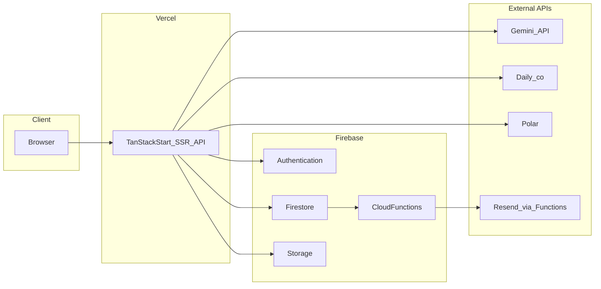
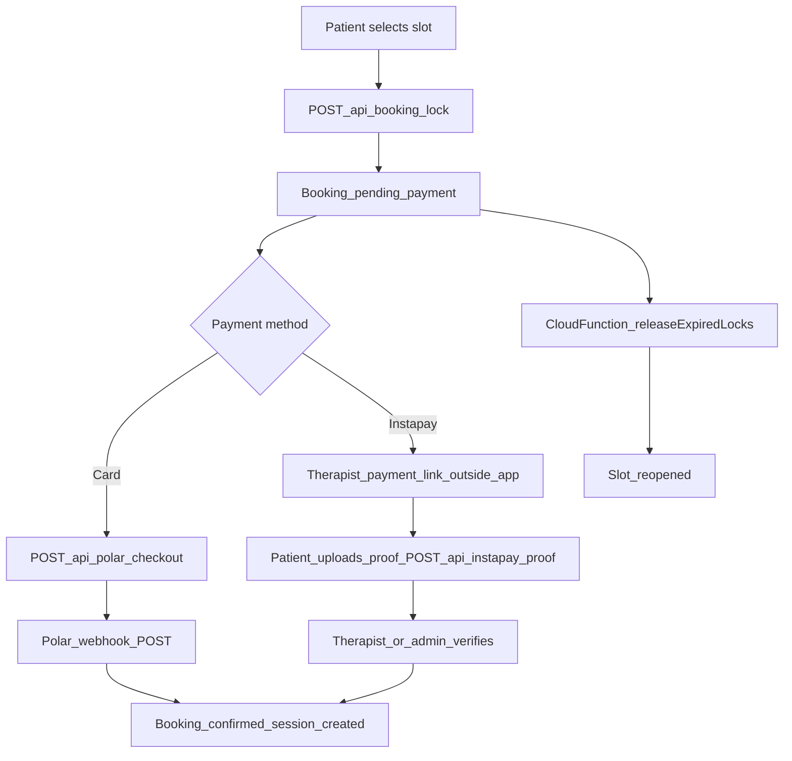
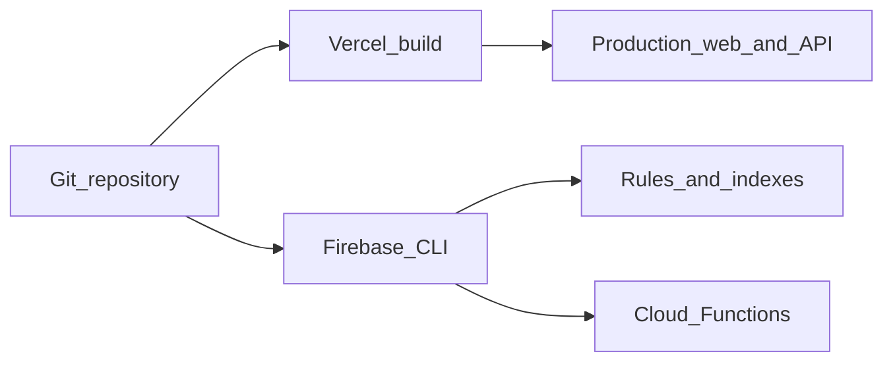

# Thera — System architecture

This document describes how **Thera** (English / Arabic mental wellness platform) is structured in production: where code runs, how data flows, and which environment variables belong to which host.

---

## 1. High-level stack

| Layer                           | Technology                                                                             |
| ------------------------------- | -------------------------------------------------------------------------------------- |
| UI                              | React 19, TanStack Router, TanStack Start, Vite, Tailwind CSS, Radix UI, Framer Motion |
| i18n                            | Custom provider (`src/i18n/`) — bilingual EN / AR                                      |
| Server routes                   | TanStack Start file routes under `src/routes/api/`** (deployed on **Vercel**)          |
| Auth & database                 | **Firebase** Authentication, Cloud Firestore, Cloud Storage                            |
| Background jobs                 | **Firebase Cloud Functions** (Gen 2, Node 20) — triggers, schedules, email             |
| AI                              | **Google Gemini** via `@google/genai` on Vercel server only                            |
| Video                           | **Daily.co** (server creates rooms / tokens when `DAILY_API_KEY` is set)               |
| Card payments                   | **Polar** (checkout + webhook on Vercel)                                               |
| Transactional email (Functions) | **Resend** (booking/report/reminder emails from Cloud Functions)                       |

---

## 2. System context (logical)

**Important:** Interactive HTTP APIs (AI chat, booking lock, Polar webhook, Instapay proof upload, etc.) run on **Vercel**, not inside Cloud Functions. Cloud Functions handle **Firestore triggers**, **scheduled jobs**, and **Resend** for specific lifecycle events.

---

## 3. Booking and payment (simplified)

- **Instapay** is not a third-party API: the therapist stores their own bank-app link; the patient pays externally and submits proof in-app.
- **Polar** uses server-side checkout creation and a signed webhook to confirm payment.

---

## 4. Deployment topology

---

## 5. Cloud Functions (Firebase)

Defined in `[functions/src/index.ts](../functions/src/index.ts)`. All use Firebase Admin; email paths use **Resend** with secrets listed below.

| Export                | Type                                 | Purpose                                                             |
| --------------------- | ------------------------------------ | ------------------------------------------------------------------- |
| `sendBookingEmail`    | Firestore `onUpdate` `bookings/{id}` | When status becomes `confirmed`, send confirmation email to patient |
| `notifyReportReady`   | Firestore `onCreate` `reports/{id}`  | Email + in-app style notification when a report is created          |
| `scheduledReminders`  | Schedule (every 15 min)              | ~24h and ~1h session reminders (email + Firestore flags)            |
| `pruneAdminLogs`      | Schedule (daily)                     | Delete old `adminLogs` past retention                               |
| `releaseExpiredLocks` | Schedule (every 5 min)               | Cancel stale `pending_payment` bookings and free slots              |

---

## 6. Vercel server API routes

File-based routes under `[src/routes/api/](../src/routes/api/)`. Representative paths (URL path ≈ file path without `.ts`):

| Area     | Routes                                                                                              |
| -------- | --------------------------------------------------------------------------------------------------- |
| AI       | `/api/ai/chat`, `/api/ai/intake`, `/api/ai/summarize`, `/api/ai/crisis-check`, `/api/ai/transcribe` |
| Booking  | `/api/booking/lock`, `/api/booking/cancel`                                                          |
| Payments | `/api/polar/checkout`, `/api/polar/webhook`, `/api/instapay/proof`                                  |
| Sessions | `/api/sessions/$id/token`, `/api/sessions/$id/end`                                                  |
| Reports  | `/api/reports/create`                                                                               |
| Admin    | `/api/admin/instapay/verify`, `/api/admin/approve-therapist`, `/api/admin/users/status`             |

Server routes that touch Firestore as admin require a valid **Firebase Admin** credential on Vercel (see env table).

---

## 7. Environment variables by host

### Vercel (Production / Preview / Development)

Set in the Vercel project dashboard. Names only — never commit secret values.

**Client (exposed to browser — `VITE_` prefix)**

| Variable                            | Purpose                                               |
| ----------------------------------- | ----------------------------------------------------- |
| `VITE_FIREBASE_API_KEY`             | Firebase Web SDK                                      |
| `VITE_FIREBASE_AUTH_DOMAIN`         | Auth domain                                           |
| `VITE_FIREBASE_PROJECT_ID`          | Project id                                            |
| `VITE_FIREBASE_STORAGE_BUCKET`      | Storage bucket                                        |
| `VITE_FIREBASE_MESSAGING_SENDER_ID` | FCM sender                                            |
| `VITE_FIREBASE_APP_ID`              | Web app id                                            |
| `VITE_FIREBASE_MEASUREMENT_ID`      | Optional Analytics                                    |
| `VITE_FIREBASE_VAPID_KEY`           | Optional web push                                     |
| `VITE_ENABLE_DEMO`                  | Optional: `"false"` to force non-demo when keys exist |

**Server only (never `VITE_`)**

| Variable                             | Purpose                                                                       |
| ------------------------------------ | ----------------------------------------------------------------------------- |
| `FIREBASE_ADMIN_KEY`                 | Service account JSON (string) for Admin SDK                                   |
| `FIREBASE_PROJECT_ID`                | Optional override                                                             |
| `FIREBASE_STORAGE_BUCKET`            | Optional override                                                             |
| `GEMINI_API_KEY` or `GOOGLE_API_KEY` | Gemini developer API ([Google AI Studio](https://aistudio.google.com/apikey)) |
| `DAILY_API_KEY`                      | Daily REST API for real rooms                                                 |
| `POLAR_ACCESS_TOKEN`                 | Polar SDK                                                                     |
| `POLAR_PRODUCT_ID`                   | Product used at checkout                                                      |
| `POLAR_WEBHOOK_SECRET`               | Webhook signature verification                                                |
| `POLAR_SERVER`                       | Optional: `sandbox` or `production`                                           |
| `PUBLIC_SITE_URL`                    | Canonical site URL (e.g. sitemap)                                             |

### Firebase Cloud Functions (secrets)

Configure with Firebase CLI, e.g. `firebase functions:secrets:set NAME`.

| Secret           | Used by                                   |
| ---------------- | ----------------------------------------- |
| `RESEND_API_KEY` | Resend client in Functions                |
| `EMAIL_FROM`     | Verified sender string                    |
| `APP_URL`        | Links inside emails (e.g. dashboard URLs) |

Gemini, Polar, and Daily **do not** run inside this repo’s Cloud Functions codebase.

---

## 8. Firestore and rules

- Rules: `[firestore.rules](../firestore.rules)`, `[storage.rules](../storage.rules)`
- Indexes: `[firestore.indexes.json](../firestore.indexes.json)`
- TypeScript document shapes: `[src/lib/types.ts](../src/lib/types.ts)`

---

## 9. Further reading

- [FEATURES.md](./FEATURES.md) — capability list by audience
- [DEPLOYMENT.md](./DEPLOYMENT.md) — setup and deploy checklist
- [README.ar.md](../README.ar.md) / [docs/ar/ARCHITECTURE.md](./ar/ARCHITECTURE.md) — Arabic summaries

