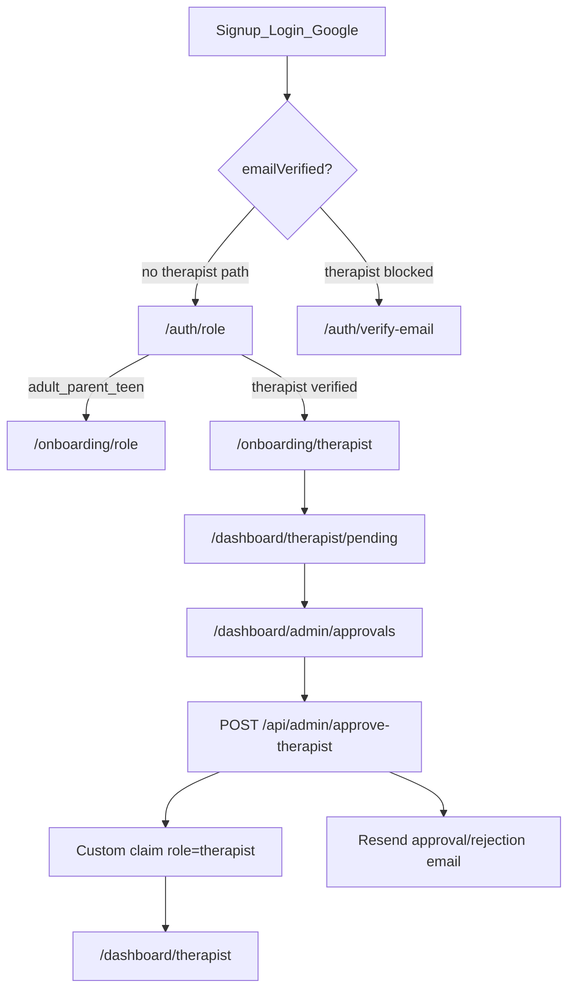

# Therapist authentication audit

Last updated: 2026-05-26

## Role model

Thera has a single clinician role: **`therapist`**. There is no separate doctor/psychiatrist account type. Optional title (e.g. “Dr.”) is display metadata during onboarding.

## Flow



## Environment checklist

| Variable | Where | Purpose |
|----------|-------|---------|
| `VITE_FIREBASE_*` | Client / Vercel | Firebase web SDK |
| `FIREBASE_ADMIN_KEY` | Vercel + scripts | Admin SDK (approve API, seed, grant-admin) |
| `PUBLIC_SITE_URL` | Vercel | Links in emails |
| `RESEND_API_KEY` | Vercel + Functions | Therapist decision + booking emails |
| `EMAIL_FROM` | Vercel + Functions | From address |

Firebase Console:

- Auth: Email/Password + Google
- Email action URL: `https://<your-domain>/auth/action`

Grant admin (only supported path):

```bash
FIREBASE_ADMIN_KEY='...' node scripts/grant-admin.mjs admin@example.com
```

## Fixes applied (2026-05-26)

| Issue | Fix |
|-------|-----|
| Email verification sent but not enforced for therapists | Block therapist role pick + onboarding until `user.emailVerified` |
| No email on approve/reject | `approve-therapist` API sends Resend email; Cloud Function `notifyTherapistApplicationDecision` as backup |
| `rejected` applicants not routed to pending UI | `auth.role` + `useDashboardUrlRoleGuard` + `useRouteGate` redirect to `/dashboard/therapist/pending` |
| Therapist dashboard accessible without claim | `RouteGuard requireRole="therapist"` on therapist home; guards redirect applicants to pending |

## Manual test script

1. **Signup** — Create account; confirm verification email arrives.
2. **Verify** — Open `/auth/action?mode=verifyEmail`; confirm redirect works.
3. **Therapist without verify** — Pick therapist on `/auth/role` before verifying → should land on `/auth/verify-email`.
4. **Onboarding** — Complete therapist onboarding → `/dashboard/therapist/pending`.
5. **Admin** — As admin, open `/dashboard/admin/approvals`; approve application.
6. **Applicant** — Pending page polls claims; redirects to `/dashboard/therapist`; check approval email.
7. **Reject path** — Reject another application; applicant sees rejection on pending; check email.
8. **Directory** — Only `approved: true` therapists appear on `/therapists`.

## Known limitations

- **Demo mode** (`!isFirebaseConfigured`): route guards are bypassed for design walkthroughs.
- **`under_review` status**: supported in queries/UI but not set automatically during review.
- **Terms governing law** still references England/Wales in `dictionary.ts` `sec12b` — update separately if the legal entity is Egypt-based.

## Key files

- `src/lib/auth.tsx` — `useRouteGate`, `effectiveRole`
- `src/routes/auth.role.tsx` — role picker
- `src/routes/onboarding.$role.tsx` — application submit
- `src/routes/dashboard.$role.pending.tsx` — waiting UI
- `src/routes/dashboard.$role.approvals.tsx` — admin UI
- `src/routes/api/admin/approve-therapist.ts` — approval API + email
- `functions/src/index.ts` — `notifyTherapistApplicationDecision`
- `firestore.rules` — client cannot self-grant `therapist` role
